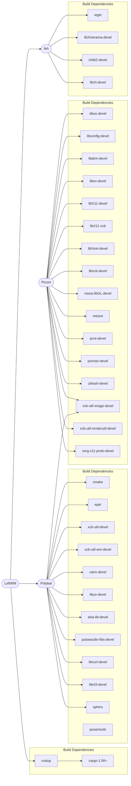

```mermaid
graph LR;
    leftwm([LeftWM])
    leftwm --> rustup
    
    subgraph leftwm_build[Build Dependencies]
    rustup --> cargo-1.56+
    end

    picom([Picom])
    picom --> dbus-devel
    picom --> libconfig-devel
    picom --> libdrm-devel
    picom --> libev-devel
    picom --> libX11-devel
    picom --> libX11-xcb
    picom --> libXext-devel
    picom --> libxcb-devel
    picom --> mesa-libGL-devel
    picom --> meson
    picom --> pcre-devel
    picom --> pixman-devel
    picom --> uthash-devel
    picom --> xcb-util-image-devel
    picom --> xcb-util-renderutil-devel
    picom --> xorg-x11-proto-devel

    subgraph picom_build[Build Dependencies]
    dbus-devel
    libconfig-devel
    libdrm-devel
    libev-devel
    libX11-devel
    libX11-xcb
    libXext-devel
    libxcb-devel
    mesa-libGL-devel
    meson
    pcre-devel
    pixman-devel
    uthash-devel
    xcb-util-image-devel
    xcb-util-renderutil-devel
    xorg-x11-proto-devel
    end


    polybar([Polybar])
    leftwm --> polybar
    polybar --> cmake
    polybar --> epel
    polybar --> xcb-util-devel
    polybar --> xcb-util-image-devel
    polybar --> xcb-util-wm-devel
    polybar --> cairo-devel
    polybar --> libuv-devel
    polybar --> alsa-lib-devel
    polybar --> pulseaudio-libs-devel
    polybar --> libcurl-devel
    polybar --> libnl3-devel
    polybar --> sphinx

    subgraph polybar_build[Build Dependencies]
    cmake
    powertools
    epel
    cmake
    xcb-util-devel
    xcb-util-image-devel
    xcb-util-wm-devel
    cairo-devel
    libuv-devel
    alsa-lib-devel
    pulseaudio-libs-devel
    libcurl-devel
    libnl3-devel
    sphinx
    end

    feh([feh])
    leftwm --> feh
    feh --> wget
    feh --> libXinerama-devel
    feh --> imlib2-devel
    feh --> libXt-devel

    subgraph feh_build[Build Dependencies]
    wget
    libXinerama-devel
    imlib2-devel
    libXt-devel
    end

```
